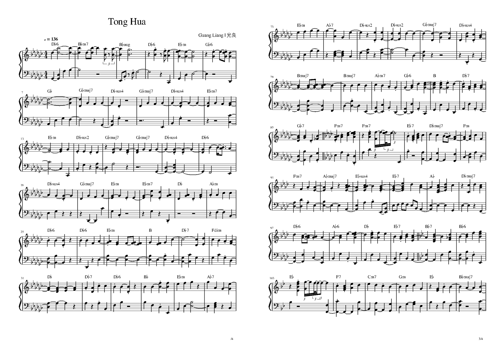
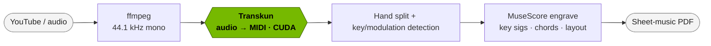

<div align="center">


<h3>Local, GPU-accelerated piano audio &rarr; engraved sheet-music PDF</h3>

[](https://www.python.org/)
[](LICENSE)
[](https://developer.nvidia.com/cuda-toolkit)
[](https://pytorch.org/)
[](CONTRIBUTING.md)

</div>

**piano2sheet** turns a piano performance — a **YouTube link** or a **local file** — into clean,
engraved sheet music. Audio is transcribed to MIDI on the GPU (**Transkun**), analyzed for key and
modulations, and engraved to **MusicXML + PDF** with **MuseScore** — with per-section key signatures,
chord symbols, a title/composer header, and page numbers.

## Demo — one command, real output

This sheet was produced from a single YouTube link ([童话 / *Tong Hua*](https://youtu.be/3Vy4j8GhTig)):

<div align="center">

</div>

```bash
python src/pipeline.py --url "https://youtu.be/3Vy4j8GhTig" --workdir runs/tonghua \
  --device cuda --cookies cache/youtube_cookies.txt --time-sig 4/4
```

Out of the box it **auto-detected two key changes** (G♭ → A♭ → B♭), **labelled every bar with a chord
symbol**, set the meter, pulled the **title + composer** from the video, and wrote a page-numbered PDF.
That's the free trial — point it at your own song and run it.

## Features

- **One command, audio → PDF** — YouTube URL or local file in, engraved PDF out.
- **GPU transcription** — Transkun (CUDA); CPU fallback via `--device cpu`.
- **Automatic key & modulation detection** — correct key signature per section (Krumhansl-Kessler + Viterbi).
- **Chord symbols** above every measure, plus a title/composer header and page-numbered footer.
- **Reproducible** — each run is a self-contained `runs/<name>/` folder.

## How it works



## Quickstart

```bash
pip install torch torchaudio --index-url https://download.pytorch.org/whl/cu128
pip install -r requirements.txt && pip install --no-deps transkun piano_transcription_inference

# Title + composer are required (auto-extracted for a YouTube URL)
python src/pipeline.py --audio song.mp3 --workdir runs/song --title "My Song" --composer "Artist"
# -> runs/song/07_score.pdf
```

Run `python src/pipeline.py --help` for every flag (manual keys, `--time-sig`, layout, chords, …).

<details>
<summary><b>Full install (apt packages, Docker, GPU prerequisites)</b></summary>

System packages and the JS runtime yt-dlp needs:

```bash
sudo apt install -y ffmpeg lilypond musescore3 fluidsynth fluid-soundfont-gm timidity xvfb
curl -fsSL https://deno.land/install.sh | sh
```

| Requirement | Tested | Notes |
|-------------|--------|-------|
| OS | Ubuntu 22.04 / 24.04 | Linux only; headless OK via `xvfb` |
| Python | 3.10+ | |
| GPU / CUDA | RTX PRO 6000 Blackwell, CUDA 12.8 | optional — `--device cpu` works |
| PyTorch | 2.11.0+cu128 | install from the `cu128` wheel index |

Docker:

```bash
docker build -t piano2sheet .
docker run --rm -it --gpus all -v "$PWD:/workspace" piano2sheet \
  python3 src/pipeline.py --audio /workspace/song.mp3 --workdir /workspace/runs/song \
  --title "Song" --composer "Artist"
```

</details>

## Outputs

```
runs/<name>/
├── 03_transkun.mid      # transcription (CUDA)
├── 06_score.musicxml    # engraved score (per-section key sigs, chords)
├── 07_score.pdf         # final sheet music (title, composer, page numbers)
└── metadata.json        # parameters + detected keys
```

> [!NOTE]
> Output PDFs are a strong starting point; rhythm and hand-splitting may still want a quick manual
> pass in MuseScore.

## For AI agents & contributors

This repo is set up for AI coding agents — read **[AGENTS.md](AGENTS.md)** / **[CLAUDE.md](CLAUDE.md)**
(pipeline contract, the mandatory title/composer rule, and safety rules). Contributions welcome:
see **[CONTRIBUTING.md](CONTRIBUTING.md)**.

## License & credits

MIT ([LICENSE](LICENSE)). Built on [Transkun](https://github.com/Yujia-Yan/Transkun),
[MuseScore](https://musescore.org/), [music21](https://web.mit.edu/music21/),
[yt-dlp](https://github.com/yt-dlp/yt-dlp), and [PyTorch](https://pytorch.org/).
