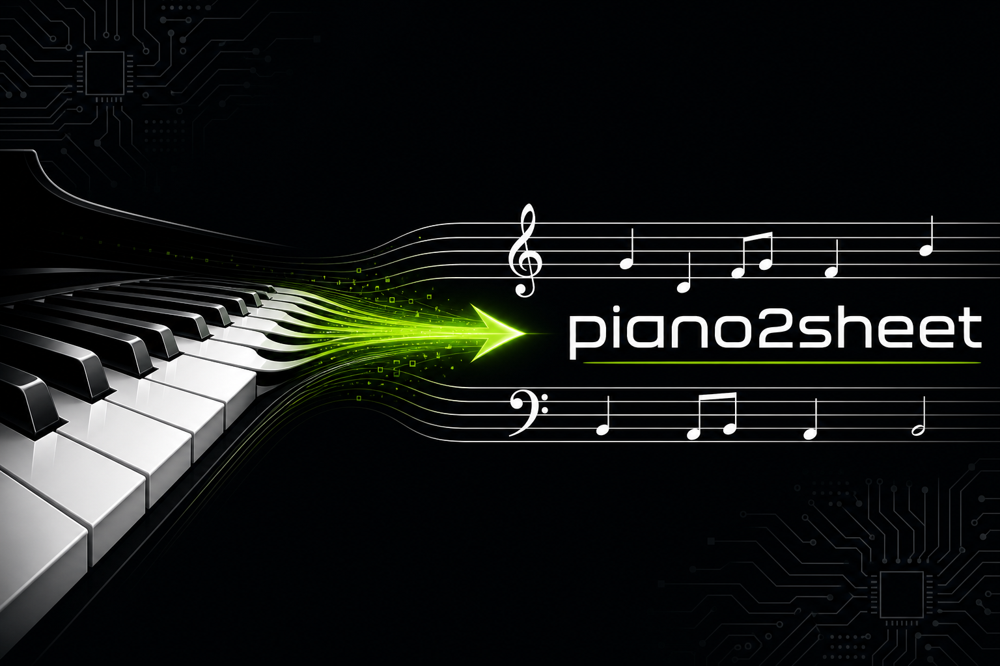
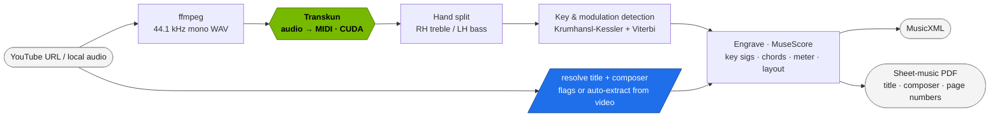

<div align="center">



<h3>Local, GPU-accelerated piano audio &rarr; engraved sheet-music PDF</h3>

[](https://www.python.org/)
[](LICENSE)
[](https://developer.nvidia.com/cuda-toolkit)
[](https://pytorch.org/)
[](https://github.com/psf/black)
[](CONTRIBUTING.md)
[](#)

</div>

## Overview

**piano2sheet** turns a piano performance — from a **YouTube link** or a **local audio file** —
into clean, engraved sheet music. Audio is transcribed to MIDI on the GPU with **Transkun**, split
into right/left hands, analyzed for key and modulations, and engraved to **MusicXML + PDF** with
**MuseScore**.

What sets it apart from a naive `audio → MIDI → PDF` chain:

- **Data-driven key & modulation detection** (Krumhansl-Kessler profiles + a Viterbi key tracker) —
  every section gets the correct key signature with minimal accidentals and a courtesy double barline
  at each change.
- **Reader-grade engraving** — grand-staff hand split, single-voice-of-chords clarity, chord symbols
  at each bar, fixed bars-per-system layout, and a `current/total` page-number footer.
- **Title & composer are first-class** — both appear on the score, and are **auto-extracted from the
  YouTube video** when you don't pass them explicitly.

> [!NOTE]
> Output PDFs are a strong starting point; rhythm and hand-splitting may still benefit from a quick
> manual pass in MuseScore.

## Features

- **One command, audio → PDF** — a YouTube URL or local file in, an engraved PDF out.
- **GPU transcription** — Transkun (CUDA) for audio→MIDI; an optional HPT engine for comparison.
- **Automatic key & modulation detection** — per-section key signatures (up/down, any number of changes).
- **Chord symbols** — a chord is detected and printed above each measure.
- **Forced meter** — re-bar to a known time signature (e.g. `4/4`) when needed.
- **Mandatory title + composer** — provided via flags or auto-extracted from the source video.
- **Reproducible jobs** — every run writes a self-contained `runs/<name>/` folder with intermediates and logs.
- **CPU fallback** — runs without a GPU via `--device cpu`.

## Architecture



## Quickstart

```bash
# 1. Install PyTorch for your CUDA, then the project deps
pip install torch torchaudio --index-url https://download.pytorch.org/whl/cu128
pip install -r requirements.txt
pip install --no-deps transkun piano_transcription_inference

# 2. Transcribe and engrave a local file (title + composer are required)
python src/pipeline.py --audio song.mp3 --workdir runs/song --device cuda \
  --title "My Song" --composer "Composer Name"
# -> runs/song/07_score.pdf
```

## Installation

### Prerequisites

| Requirement | Tested / supported | Notes |
|-------------|--------------------|-------|
| OS | Ubuntu 22.04 / 24.04 (x86-64) | Linux only; headless servers OK via `xvfb` |
| Python | 3.10+ | use a virtualenv (`.venv`) |
| NVIDIA GPU + driver | RTX PRO 6000 Blackwell (sm_120) | optional — CPU fallback with `--device cpu` |
| CUDA | 12.8 | PyTorch installed from the `cu128` wheel index |
| PyTorch | 2.11.0+cu128 | see command below |

**System packages (apt):**

```bash
sudo apt update && sudo apt install -y \
  ffmpeg lilypond musescore3 fluidsynth fluid-soundfont-gm timidity xvfb
# JS runtime for yt-dlp's YouTube challenge solver:
curl -fsSL https://deno.land/install.sh | sh
```

### Bare-metal (virtualenv)

```bash
python -m venv .venv && source .venv/bin/activate
pip install torch torchaudio --index-url https://download.pytorch.org/whl/cu128
pip install -r requirements.txt
# transcription engines are installed without deps so they don't downgrade torch:
pip install --no-deps transkun piano_transcription_inference
```

### Docker

```bash
docker build -t piano2sheet .
docker run --rm -it --gpus all -v "$PWD:/workspace" piano2sheet \
  python src/pipeline.py --audio /workspace/song.mp3 --workdir /workspace/runs/song \
  --title "My Song" --composer "Composer Name"
```

## Usage

> [!IMPORTANT]
> **Title and composer are mandatory.** Pass `--title` / `--composer`, or omit them for a YouTube
> URL and the pipeline will **auto-extract** them from the video metadata (`track`/`title` and
> `artist`/`uploader`). For a local file with neither provided, the run stops with a clear error.

```bash
# From a YouTube link — title/composer auto-extracted if omitted
# (cookies clear the bot-check; deno solves the JS challenge)
python src/pipeline.py --url "https://youtu.be/<id>" \
  --workdir runs/<name> --gpu 0 --device cuda --engine transkun \
  --cookies cache/youtube_cookies.txt

# Override the auto-extracted metadata explicitly
python src/pipeline.py --url "https://youtu.be/<id>" --workdir runs/<name> \
  --cookies cache/youtube_cookies.txt \
  --title "Tong Hua" --composer "Guang Liang | 光良"

# From a local audio file (title + composer required here)
python src/pipeline.py --audio /path/song.mp3 --workdir runs/<name> --device cuda \
  --title "My Song" --composer "Composer Name"
```

<details>
<summary>More examples (manual keys, compact layout, force meter)</summary>

```bash
# Override detected keys and their bar boundaries (quarter-note offsets)
python src/pipeline.py --audio song.mp3 --workdir runs/song \
  --title T --composer C --keys Gb,Ab,Bb --key-bars 342,399

# Pack more systems per page and force 4/4
python src/pipeline.py --audio song.mp3 --workdir runs/song \
  --title T --composer C --style style/compact.mss --staff-mm 1.675 --time-sig 4/4
```

</details>

## Configuration

Run `python src/pipeline.py --help` for the full list. Most-used flags:

| Flag | Default | Description |
|------|---------|-------------|
| `--url` / `--audio` | — | Input source (exactly one is required) |
| `--workdir PATH` | — | Output job folder (required) |
| `--title S` / `--composer S` | auto | Score title & composer; auto-extracted from a URL when omitted |
| `--device {auto,cuda,cpu}` | `auto` | Compute device |
| `--gpu N` | `0` | Physical GPU id to expose to the job |
| `--engine {transkun,hpt,both}` | `transkun` | Transcription engine |
| `--cookies PATH` | — | Netscape `cookies.txt` for YouTube |
| `--split-point N` | `60` | MIDI pitch dividing RH (≥) from LH (<); 60 = middle C |
| `--time-sig S` | — | Force a meter, e.g. `4/4` (re-bars in music21) |
| `--bars-per-system N` | `6` | Bars per system (0 = let MuseScore decide) |
| `--staff-mm F` | `1.75` | Staff size in mm (smaller fits more; 1.675 ≈ Gould's ideal) |
| `--style PATH` | `style/piano.mss` | MuseScore style; use `style/compact.mss` to pack more per page |
| `--key-penalty F` | `1.5` | Viterbi key-switch penalty (higher = fewer key changes) |
| `--keys` / `--key-bars` | — | Manual key sigs + boundaries (skips detection) |
| `--no-key-detect` | off | Use MuseScore's single global key |
| `--no-chords` | off | Don't print chord symbols |
| `--no-chord-merge` | off | Keep dense multi-voice instead of one voice of chords |

## How key detection works

`src/keysig.py` slides a duration-weighted pitch-class histogram across the piece, scores each window
against all 24 Krumhansl-Kessler key profiles (Pearson correlation), and runs a **Viterbi** pass whose
only transition cost is a switch penalty — so the key only changes on strong, sustained evidence
(real modulations), not on passing chromatics. Short segments are merged, boundaries snap to barlines,
and `src/engrave_keys.py` writes the correct key signature for each section.

## Outputs

Each run writes a self-contained folder:

```
runs/<name>/
├── 00_source.url             # the input URL (for YouTube jobs)
├── 03_transkun.mid           # transcription (CUDA)
├── 05_2hand.mid              # after RH/LH split
├── 06_score.musicxml         # engraved score (per-section key sigs, chords)
├── 07_score.pdf              # final sheet music (title, composer, page-numbered footer)
├── metadata.json             # run parameters + detected keys + title/composer
└── run.log
```

(The large `01_raw_audio.*` and `02_audio_*.wav` intermediates are produced locally but git-ignored.)

## Project structure

```
piano2sheet/
├── src/
│   ├── pipeline.py        # end-to-end CLI (download → transcribe → engrave)
│   ├── notation.py        # hand-split (RH treble / LH bass) at the MIDI level
│   ├── keysig.py          # data-driven key / key-change detection (Viterbi over 24 keys)
│   ├── engrave_keys.py    # per-section key signatures, chords, meter, layout
│   ├── cookies_to_netscape.py  # browser Cookie header → cookies.txt for yt-dlp
│   └── make_test_audio.py # synthesize a clip for a no-network self-test
├── style/                 # MuseScore .mss styles (piano.mss default, compact.mss dense)
├── runs/                  # one folder per job
├── docs/                  # design notes
├── AGENTS.md · CLAUDE.md · .cursor/rules/   # instructions for AI coding agents
├── Dockerfile · requirements.txt
└── README.md
```

## For AI agents

This repo is set up for AI coding agents (Cursor, Claude Code, etc.). Read **[AGENTS.md](AGENTS.md)**
(and **[CLAUDE.md](CLAUDE.md)**, **[.cursor/rules/](.cursor/rules/)**) before working — they document
the pipeline contract, the **mandatory title/composer + auto-extraction** rule, the run/output layout,
and the safety rules (never commit `cache/` cookies).

## Troubleshooting

<details>
<summary>Common issues</summary>

- **`torch.cuda.is_available()` is False** — install the CUDA build: `pip install torch --index-url https://download.pytorch.org/whl/cu128`; verify your driver supports your GPU.
- **MuseScore renders nothing on a headless server** — it runs under `xvfb-run` automatically; ensure `xvfb` is installed.
- **YouTube download fails the bot check** — pass `--cookies cache/youtube_cookies.txt` and ensure `deno` is on `PATH`.
- **"Title and composer are required"** — pass `--title`/`--composer`, or use a YouTube URL so they can be auto-extracted.

</details>

## Contributing

Contributions and PRs are welcome — see [CONTRIBUTING.md](CONTRIBUTING.md).

## License

Released under the MIT License. See [LICENSE](LICENSE).

## Acknowledgements

Built on [Transkun](https://github.com/Yujia-Yan/Transkun), [MuseScore](https://musescore.org/),
[music21](https://web.mit.edu/music21/), [yt-dlp](https://github.com/yt-dlp/yt-dlp), and
[PyTorch](https://pytorch.org/). Key-finding uses the Krumhansl-Kessler profiles; engraving conventions
follow Elaine Gould's *Behind Bars* and the MuseScore Handbook.
